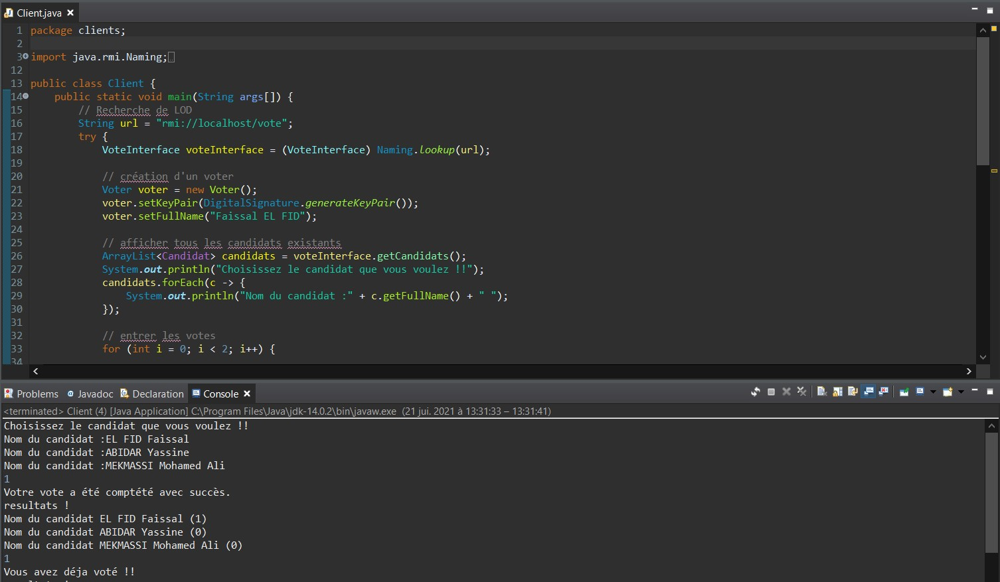
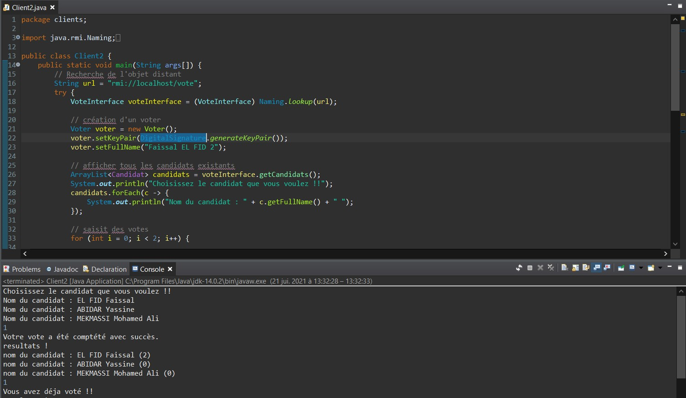

# java-rmi-digital-signature

Le but de ce projet est de créer un système de votes qui permet à des électeurs de voter les candidats en toutes sécurité et en gardant leur anonymat. 
Pour ce faire je vais utiliser la signature digital de java.security.Signature (DSA).

## Table des matières
1. [Principes généraux](#general-principles)
2. [Commentaires](#comment)
3. [Exécuter le projet](#test)

## 1. Principes généraux
La définition de la signature électronique :
>La signature numérique est un mécanisme permettant de garantir l'intégrité d'un document électronique et d'en authentifier l'auteur, par analogie avec la signature 
>manuscrite d'un document papier.

### Architecture de signature
L’électeur chiffre le message d’une façon asymétrique constitué d'une fonction de chiffrement C et qui a une fonction de déchiffrement D. J’utilise une fonction de hachage que nous noterons H.
Pour ce chiffrement, le système génère une clé privée Kpr et une clé publique Kpb pour chaque électeur (voter) :
Il garde la clé privée Kpr secrète.
D, H et Kpb n'ont pas besoin d'être secrets. C doit par contre rester secret.

#### Préparation du message signé
L’électeur prépare le message signé, pour cela :
Il produit un condensat du message par la fonction de hachage choisie. Il chiffre ce condensat grâce à la fonction de chiffrement C en utilisant sa clé privée Kpr. Le résultat obtenu est la signature du message : SM.
Il transmet la clé publique Kpb, le message en claire et la signature du message SM par un canal (RMI) sachant que le serveur connait la fonction de hachage H.
L’électeur transmet Msigné, le message signé vers le serveur par un canal non sécurisé.

### Réception du message signé
Le serveur réceptionne le message signé. Pour vérifier l'authenticité du message :

Il produit un condensat du texte clair en utilisant la fonction de hachage H(M) .
Il déchiffre la signature en utilisant la fonction de déchiffrement D avec la clé publique Kpb soit : DSm=D(Kpb,SM) ;
Il compare le résultat DSm avec H(M) reçu.
Dans le cas où la signature est authentique, DSm et H(M) sont égaux car, de par les propriétés du chiffrement asymétrique on attribue le vote au candidat.

## 2. Commentaires
Vous allez trouver dans chaque fichier java des commentaires qui explique l’objectif de chaque méthode utilisée.

## 3. Exécuter le projet

* Exécuter le Serveur en permier

* Exécuter le client 1 (voter 1)

* Exécuter le client 2 (voter 2)

